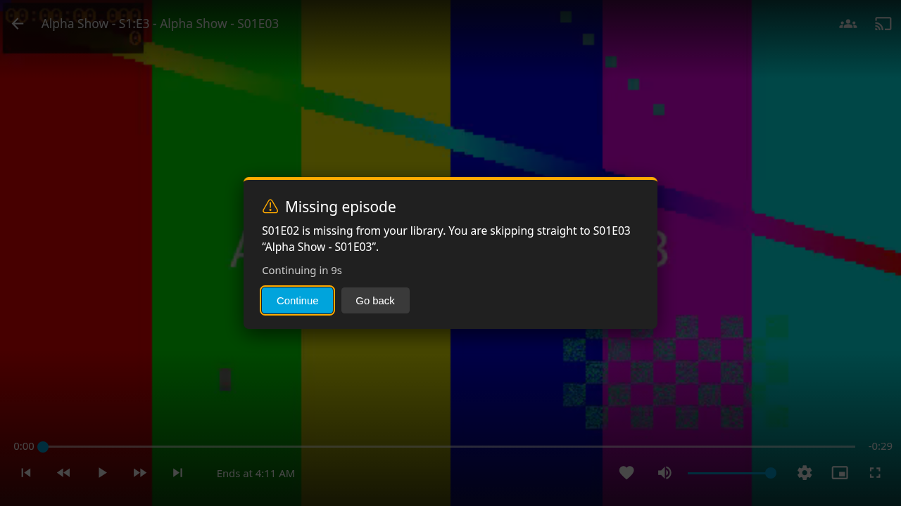
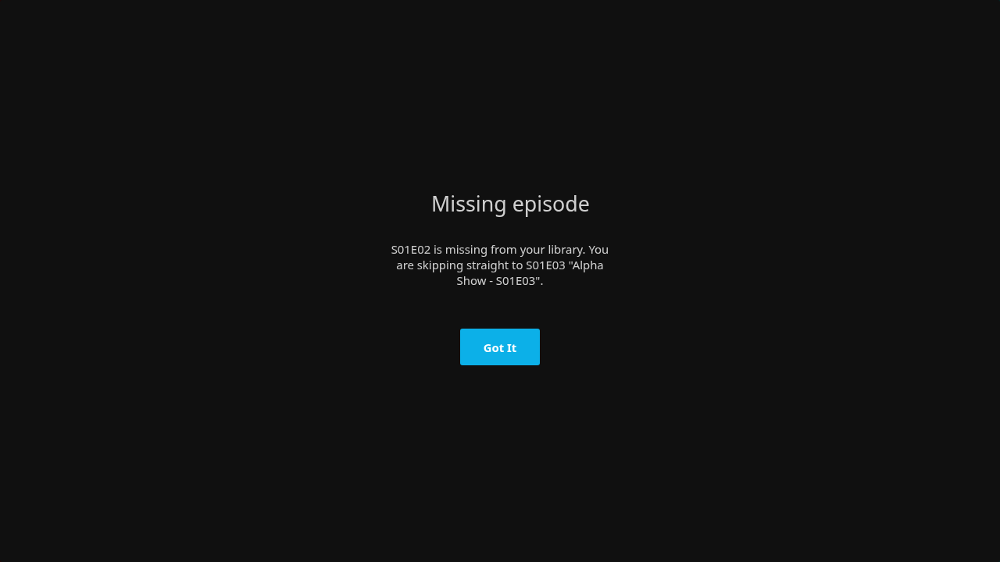
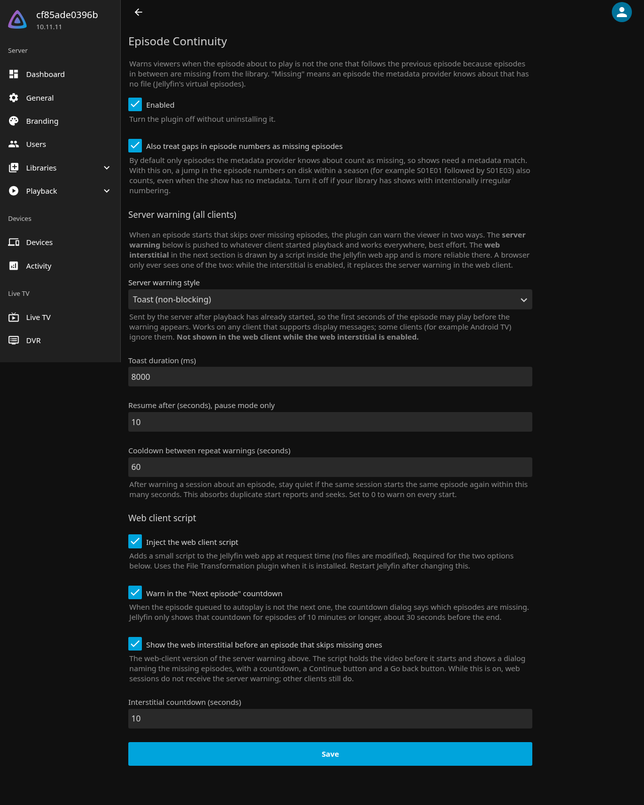

# Jellyfin Episode Continuity plugin

> **Disclaimer: this plugin was vibe-coded with AI assistance.** The design, code, tests and
> documentation were produced in a conversation with an AI coding assistant, reviewed and tried
> out by a human, but not audited line by line. It works on the author's setup. Read the code
> before trusting it with anything you care about, and please open an issue if something breaks.

Warns viewers when the episode about to play is **not** the one that follows the previous
episode, because episodes in between are missing from the library. Have S01E01 and S01E03 but not
S01E02? Autoplay in Jellyfin silently jumps from 1 to 3. This plugin makes that visible.

## What it does

The plugin detects the gap on the server and warns at playback time, in three places.

### Warning in the "Next episode" countdown (web)

When jellyfin-web shows its autoplay countdown and the queued episode is not the next one, the
dialog says which episodes are missing and which one will actually play.


### Pre-play interstitial (web)

Starting an episode that skips missing ones holds the video and shows a dialog with a countdown,
**Continue** and **Go back**.



### Server warning (all clients)

For clients without the web script, the server pushes a warning to the session that started
playback. It can be a toast, a dialog with an OK button, or pause plus dialog plus timed resume.
Best effort: some clients ignore display messages.

| Toast | Dialog |
| --- | --- |
|  |  |

A browser only ever sees one of the two: while the interstitial is enabled it replaces the server
warning in the web client.

### What counts as missing

By default "missing" means a **virtual episode**: an item Jellyfin holds for an episode that has
no file. On a default Jellyfin install these never exist. Core Jellyfin stopped creating them in
10.7, and today the only thing that does is the TVDB plugin's **Missing Episode Fetcher**, a
metadata fetcher that is separate from TheTVDB itself. TMDb cannot create virtual episodes at
all, and a metadata match on its own is not enough. See [Requirements](#requirements) below.

The option **Also treat gaps in episode numbers as missing episodes** does not need virtual
episodes. It counts a jump in the episode numbers on disk within a season (S01E01 followed by
S01E03) as a gap. Its limits: it only sees holes *between* two episodes you have in the same
season, so it cannot notice a missing first or last episode of a season and never spans a season
boundary, and it misfires on shows that are numbered irregularly on purpose.

## Settings

Dashboard → Plugins → Episode Continuity.



| Setting | Default | Meaning |
| --- | --- | --- |
| Enabled | on | Master switch. |
| Also treat gaps in episode numbers as missing | off | Count numbering jumps on disk as gaps, not only provider-known virtual episodes. |
| Server warning style | Toast | Off, toast, dialog, or pause + dialog + resume. |
| Toast duration | 8000 ms | How long the toast stays up. |
| Resume after | 10 s | Delay before unpausing in pause mode. |
| Cooldown between repeat warnings | 60 s | Do not warn the same session about the same episode again within this window. 0 warns on every start. |
| Inject the web client script | on | Required for the two web features. Restart Jellyfin after changing. |
| Warn in the "Next episode" countdown | on | Web up-next warning. |
| Show the web interstitial | on | Web pre-play dialog. Suppresses the server warning for that browser. |
| Interstitial countdown | 10 s | Seconds before the interstitial continues on its own. |

## How the web features work

Jellyfin has no official client extension point, so the plugin adds one `<script>` tag to the web
app's `index.html` at request time through ASP.NET middleware. No file on disk is modified and the
change disappears when the plugin is removed. If the
[File Transformation](https://github.com/IAmParadox27/jellyfin-plugin-file-transformation) plugin
is installed, the plugin registers with it instead so only one component rewrites the page.

The script talks to the plugin's own endpoints:

- `GET /EpisodeContinuity/Items/{itemId}/Continuity`
- `GET /EpisodeContinuity/ClientConfig`
- `POST /EpisodeContinuity/Hello`
- `GET /EpisodeContinuity/client.js`

## Installation

Requires Jellyfin 10.11.

### Requirements

The plugin can only warn about episodes Jellyfin knows are missing. Unless you use the
numbering-gaps option, all four of these must hold or it will never fire:

1. The [TVDB plugin](https://github.com/jellyfin/jellyfin-plugin-tvdb) is installed. Core
   Jellyfin has not created virtual episodes since 10.7.
2. In the TV library's settings, under **Metadata fetchers → Series**, **Missing Episode
   Fetcher** is ticked. This is a different checkbox from **TheTVDB**; ticking TheTVDB alone
   does nothing.
3. The series has a TVDB id. The fetcher checks for that id specifically, so a match from
   another provider does not count.
4. A metadata refresh of the library has run since the above were set up.

If you would rather not run the TVDB plugin, enable **Also treat gaps in episode numbers as
missing episodes** in the plugin settings instead. It is the only mode that works on a default
install, with the limits described under [What counts as missing](#what-counts-as-missing).

### Steps

1. Dashboard → Plugins → Repositories → **+**, and add the repository manifest URL from the
   [releases page](../../releases).
2. Dashboard → Plugins → Catalog, install **Episode Continuity**, restart Jellyfin.
3. Hard-refresh any open browser tab so it picks up the injected script.

To install by hand instead, unzip the release into a new folder under Jellyfin's `plugins`
directory and restart.

## Troubleshooting

The failure mode is silent: with nothing to detect, the plugin logs nothing and shows nothing.
Check whether Jellyfin has any virtual episodes at all, with an API key or a logged-in token:

```
GET /Items?includeItemTypes=Episode&isMissing=true&recursive=true&limit=1
```

If `TotalRecordCount` is 0, none of the [Requirements](#requirements) are satisfied and no gap
can ever be detected, regardless of plugin settings. Fix the library setup or turn on the
numbering-gaps option. Once episodes are reported, check a specific one with
`GET /EpisodeContinuity/Items/{itemId}/Continuity`, which returns `hasGapBefore` and the list of
missing episodes.

## Development

Open in VS Code and reopen in the devcontainer. It starts a Jellyfin 10.11 server on
http://localhost:8097 with `media/` mounted as `/media` and `dist/plugins` as the plugin directory.

- `scripts/deploy.sh` builds the plugin, copies it into Jellyfin, and restarts the server.
- `dotnet test` runs the unit tests.
- `scripts/e2e/` drives real jellyfin-web in headless Chrome; see its README. `screenshots.js`
  in the same folder regenerates the images in `docs/screenshots/`.
- `scripts/package.sh` produces a release zip and repository manifest.

`spec.md` records the agreed scope, `docs/research.md` the feasibility research and prior art,
`docs/plan.md` the implementation plan.

## License

[GPL-3.0-or-later](LICENSE).
